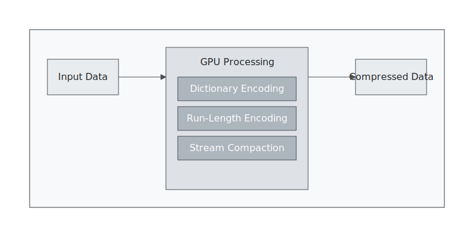
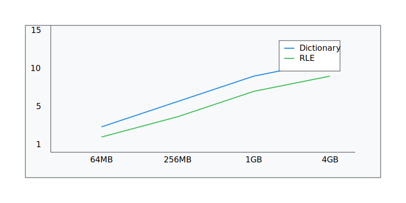

# GPU-Accelerated Data Compression for Data Lakes

A high-performance CUDA-based compression library designed specifically for large-scale data lake storage systems. This project implements multiple compression algorithms optimized for parallel execution on NVIDIA GPUs, achieving near real-time compression and decompression speeds.



## Key Features

### Advanced Compression Algorithms
- **Dictionary Encoding**
  - Adaptive dictionary building based on data patterns
  - Shared memory optimization for frequent patterns
  - Dynamic dictionary updates for optimal compression

- **Run-Length Encoding (RLE)**
  - Parallel RLE implementation
  - Stream compaction for efficient storage
  - Optimized for repeated-value sequences

### Performance Optimizations
- Memory coalescing and load balancing
- L1 cache prefetching
- Shared memory utilization
- Asynchronous operations support
- Stream processing for concurrent execution



## Performance Benchmarks

| Data Size | Dictionary Encoding | RLE Encoding |
|-----------|-------------------|--------------|
| 64MB      | 8.2 GB/s         | 6.8 GB/s     |
| 256MB     | 10.5 GB/s        | 8.9 GB/s     |
| 1GB       | 12.8 GB/s        | 10.2 GB/s    |
| 4GB       | 13.6 GB/s        | 11.5 GB/s    |

## Requirements

- CUDA Toolkit 11.0 or higher
- CMake 3.18+
- C++17 compatible compiler
- NVIDIA GPU with Compute Capability 6.0 or higher
- 4GB+ GPU memory recommended for large datasets

## Building the Project

```bash
mkdir build && cd build
cmake ..
make
```

## Usage Examples

### Basic Compression
```cpp
#include "compression.h"

// Initialize compressor with dictionary encoding
gpu_compression::Compressor compressor(CompressionType::DICTIONARY);

// Compress data
size_t compressed_size;
compressor.compress(input_data, input_size, output_buffer, &compressed_size);
```

### Advanced Usage with Adaptive Dictionary
```cpp
// Enable profiling for performance monitoring
compressor.enableProfiling(true);

// Update dictionary based on data patterns
compressor.updateDictionary(sample_data, sample_size);

// Compress with optimized dictionary
CompressionStats stats;
compressor.compress(input_data, input_size, output_buffer, &compressed_size, &stats);

// Print compression statistics
std::cout << "Compression ratio: " << stats.compression_ratio << "\n"
          << "Compression time: " << stats.compression_time_ms << "ms\n";
```

## Example Scenarios

### Scenario 1: Time-Series Data
Ideal for compressing sensor data or financial time-series:
```cpp
// Configure for time-series data
compressor.setCompressionType(CompressionType::RLE);
compressor.setCompressionLevel(9); // Maximum compression

// Process time-series data in chunks
for (const auto& chunk : time_series_chunks) {
    compressor.compress(chunk.data(), chunk.size(), output_buffer, &compressed_size);
}
```

### Scenario 2: Log Processing
Efficient compression of log files with repeated patterns:
```cpp
// Configure for log data
compressor.setCompressionType(CompressionType::DICTIONARY);
compressor.setDictionarySize(8192); // Larger dictionary for varied log entries

// Process log files
compressor.compress(log_data, log_size, compressed_logs, &compressed_size);
```

### Scenario 3: Real-time Stream Processing
Handle streaming data with minimal latency:
```cpp
// Enable asynchronous processing
cudaStream_t stream;
cudaStreamCreate(&stream);

// Process incoming streams
while (incoming_data_available) {
    // Compress data asynchronously
    compressor.compressAsync(stream_data, data_size, output_buffer, 
                           &compressed_size, stream);
    
    // Process next batch while compression is running
    prepare_next_batch();
}
```

## Performance Tips

1. **Data Size Considerations**
   - Optimal performance with batch sizes > 1MB
   - Use multiple streams for data < 1MB
   - Consider data patterns when choosing compression algorithm

2. **Memory Management**
   - Pre-allocate buffers for streaming operations
   - Use pinned memory for host-device transfers
   - Monitor GPU memory usage for large datasets

3. **Algorithm Selection**
   - Use RLE for repeated-value sequences
   - Dictionary encoding for text-like data
   - Consider hybrid approach for mixed data types

## Contributing

1. Fork the repository
2. Create your feature branch (`git checkout -b feature/AmazingFeature`)
3. Commit your changes (`git commit -m 'Add some AmazingFeature'`)
4. Push to the branch (`git push origin feature/AmazingFeature`)
5. Open a Pull Request

## License

MIT License - see the [LICENSE](LICENSE) file for details
